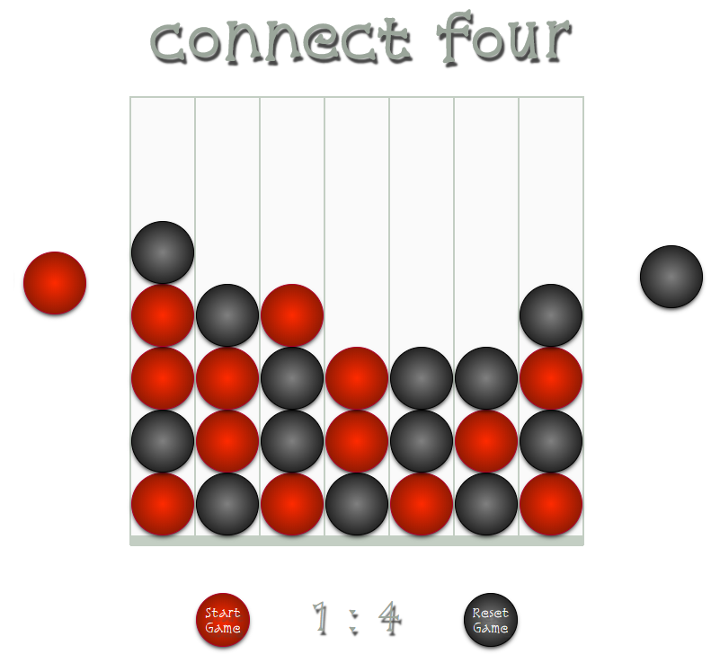

  
game  published at:    https://ev-ran.github.io/Connect-Four-Game/.

## Connect four

Connect Four implemented with HTML, CSS, and JavaScript. In each game, the players will be sitting at the same mouse & keyboard, alternating turns.

#### Actions in game
*  Changing Turn [ red - black] every new game 
*  Show -whose turn in every step
* Calculate and show the game score 

* Reset game [Clear the game score]
*  build random combinations with balls - just for fun.